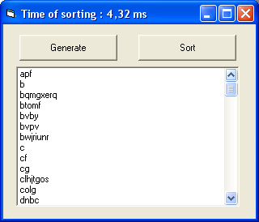

## Fast text sort

### Description

This is very fast text sorting. It includes 2 functions : Text_Sort and Text_QuickSort. It can sort 100 strings for 0,7 ms. The code is very easy and commented.
 
### More Info
 

             |
---                |---
**Submitted On**   |2006-12-03 20:59:04
**By**             |[Safo](https://github.com/Planet-Source-Code/PSCIndex/blob/master/ByAuthor/safo.md)
**Level**          |Beginner
**User Rating**    |5.0 (15 globes from 3 users)
**Compatibility**  |VB 6\.0
**Category**       |[String Manipulation](https://github.com/Planet-Source-Code/PSCIndex/blob/master/ByCategory/string-manipulation__1-5.md)
**World**          |[Visual Basic](https://github.com/Planet-Source-Code/PSCIndex/blob/master/ByWorld/visual-basic.md)
**Archive File**   |[Fast\_text\_2049232212007\.zip](https://github.com/Planet-Source-Code/safo-fast-text-sort__1-67253/archive/master.zip)

